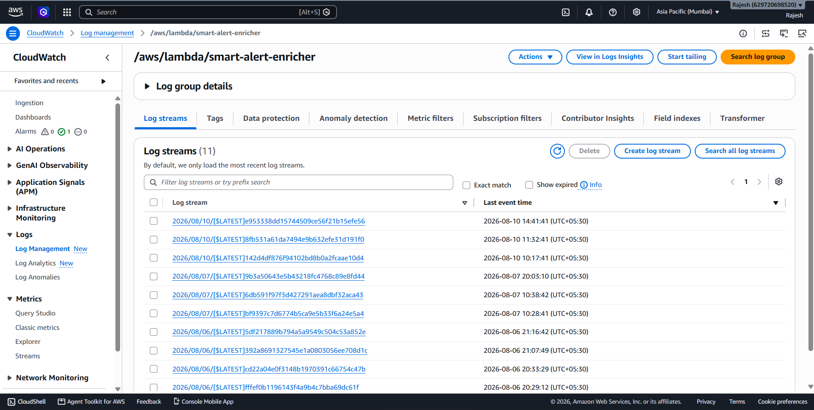
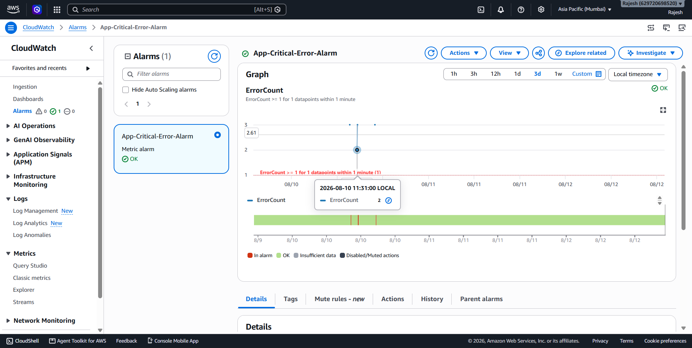
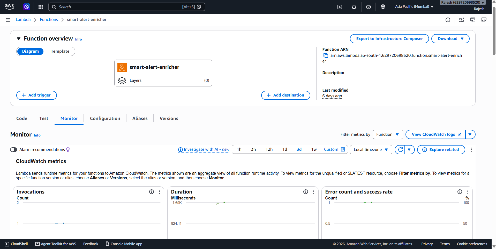
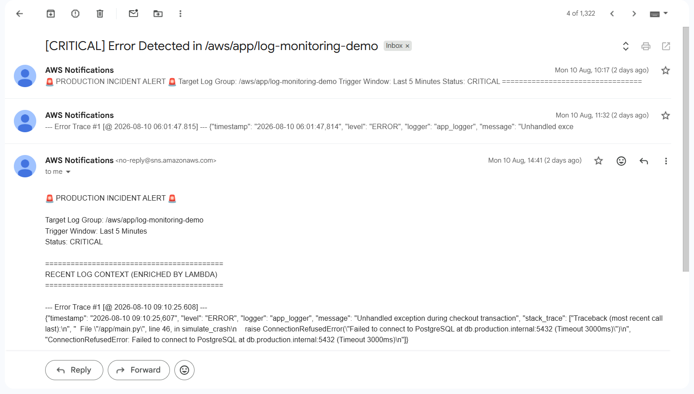

# 🚨 AWS Automated Intelligent Alert Enrichment Pipeline

An end-to-end event-driven observability pipeline built on AWS. Rather than sending plain, uninformative alarm notifications, this pipeline uses CloudWatch, AWS Lambda, and SNS to query live logs upon an incident, extract full stack traces, and deliver enriched, actionable diagnostic alerts to developers in real-time.

---

## 🏗️ Architecture & Workflow

```text
[ EC2 App ] ──(STDOUT)──> [ CloudWatch Logs ] ──> [ Metric Alarm ] ──> [ Lambda Enricher ] ──> [ SNS Topic ] ──> [ Developer Inbox ]
```

1. **Application (EC2 & Docker):** FastAPI containerized app running on EC2 logs structured exceptions to STDOUT.
2. **Log Aggregation:** Docker `awslogs` driver streams logs directly to AWS CloudWatch Log Group `/aws/app/log-monitoring-demo`.
3. **Threshold Monitoring:** CloudWatch Metric Filter detects `ERROR` patterns and triggers `App-Critical-Error-Alarm`.
4. **Intelligent Enrichment:** CloudWatch Alarm invokes the `smart-alert-enricher` Lambda function on state transition (`OK` → `IN ALARM`).
5. **Insights Query:** Lambda executes a CloudWatch Logs Insights query to fetch exact error stack traces from the last 5 minutes.
6. **Enriched Alerting:** Lambda formats a detailed incident report with stack traces and publishes it via AWS SNS to developer email inboxes.

---

## 🛠️ Tech Stack & AWS Services

* **Application:** Python 3.11/3.15, FastAPI, Uvicorn, Docker, Amazon ECR
* **Compute & Infrastructure:** Amazon EC2, AWS CloudShell
* **Observability & Alerting:** AWS CloudWatch Logs, Metric Filters, CloudWatch Alarms, CloudWatch Logs Insights
* **Serverless Execution:** AWS Lambda (Python runtime with IAM Resource-Based Policies)
* **Messaging:** AWS SNS (Simple Notification Service)

---

## 📁 Repository Structure

```text
aws-smart-alert-enrichment/
├── app/
│   ├── main.py                 # FastAPI application with /simulate-crash
│   ├── Dockerfile              # Container setup
│   └── requirements.txt        # Dependencies
├── lambda/
│   └── smart_alert_enricher.py # Lambda enrichment engine script
├── docs/
│   └── AWS_Smart_Alert_Enrichment_Pipeline_Guide.docx  # Full project documentation
├── .gitignore
└── README.md
```
---

## 📸 Pipeline Showcase & Proof of Work

### 1. Log Ingestion & Aggregation

*Docker `awslogs` driver streaming application crash logs directly to CloudWatch Log Group `/aws/app/log-monitoring-demo`.*[cite: 1, 3]

### 2. Alarm State Transition

*CloudWatch Metric Filter detecting error threshold breach and transitioning `App-Critical-Error-Alarm` to `IN ALARM`.*[cite: 1, 3]

### 3. Lambda Enrichment Engine

*Lambda function executing CloudWatch Logs Insights query to extract recent stack traces.*[cite: 1, 3]

### 4. Enriched Incident Notification

*Detailed production incident notification delivered to email inbox via SNS with full error stack trace context.*[cite: 1, 3]
